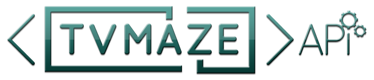

# TVMAZE : Movie website:

> This JavaScript capstone project is built on the [TVMAZE API](https://www.tvmaze.com/api), an external API, and Microverse's in-house [Involvement API](https://www.notion.so/microverse/Involvement-API-869e60b5ad104603aa6db59e08150270). The cards display the movies information that was retrieved from the API. The user has the option to like and comment on the sepecific movie.

## Built With

- HTML5, JavaScript, and API
- SASS
- JEST TEST
- Linters:
  - Stylelint, Lighthouse, Webhint and ESLint

## Project Documentation

- Here is the [link](https://drive.google.com/drive/folders/17o3iaSsckB2VS-Q7n8N79L5p4VNUMSq4?usp=sharing) to our Zoom video presentation

## Website Mockup 📱 💻 🖥️

## Deployment
- The live version of this web application is deployed here:
- Link:   https://mukumbuta.github.io/Module-Two-Capstone-Project/

## Live Demo

enjoy watching [TVMAZE](https://maaloum.github.io/into-film/dist/)

## Getting Started

To get a local copy up and running follow these simple example steps.

### Usage
- `npm i` for installing dev dependecies
- `npm run build` or `npm start` to see the project
### Run tests
- `npm test`
### Deployment
- `npm run deploy`

## Authors

👤 **Maaloum**

- GitHub: [@maaloum](https://github.com/maaloum)
- LinkedIn: [Maaloum Ely Cheick](https://www.linkedin.com/in/ely-cheikh-maaloum-075a79135/)

👤 **
👨‍💻
Emmanuel Simasiku **

- GitHub: [@Mukumbuta](https://github.com/Mukumbuta)
- Twitter: [@sharkleshevons](https://twitter.com/mukumbuta8)
- LinkedIn: [Emmanuel Simasiku](https://www.linkedin.com/in/mukumbuta)

## 🤝 Contributing

Contributions, issues, and feature requests are welcome!

Feel free to check the [issues page](../../issues/).

## Show your support

Give a ⭐️ if you like this project!

## Acknowledgments
- [Microverse](https://microverse.org)

## 📝 License

This project is [MIT](./MIT.md) licensed.
